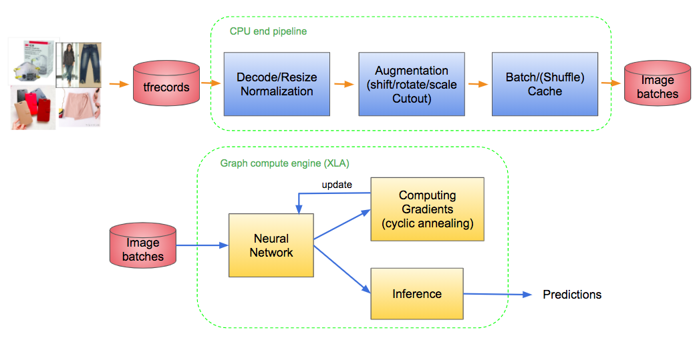
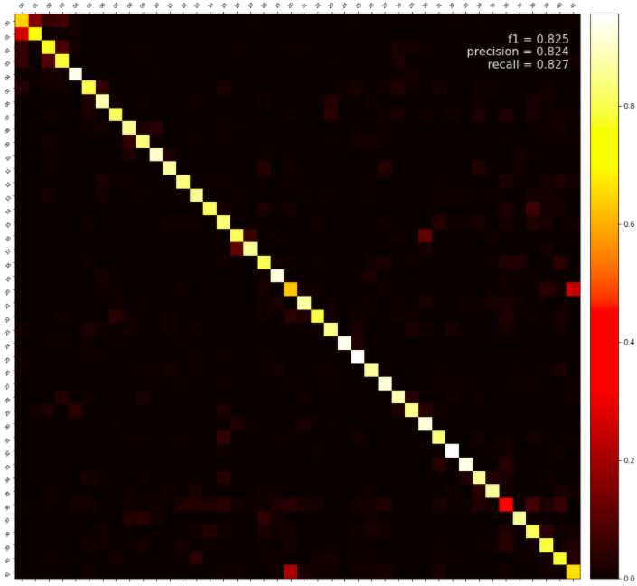
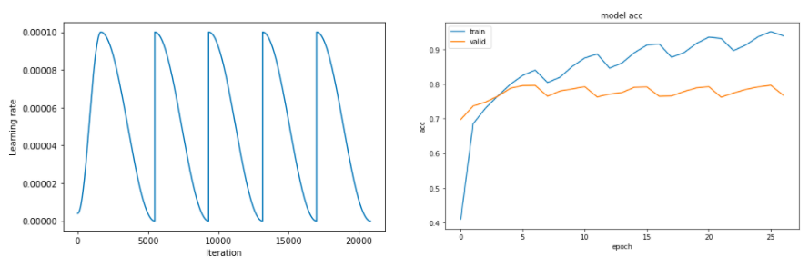

# Shopee Code League - Product Categorization
This is the 7th place solution to the competition [Shopee Code League image competition](https://www.kaggle.com/c/shopee-product-detection-open).

## Overview
The final submission is ensemble of efficientnet-b4, efficientnet-b5, their checkpoints, and test-time augmentations.  

### TPU/XLA data pipeline
Based on the previous experience in [Kaggle flower competition](https://www.kaggle.com/c/flower-classification-with-tpus/), we decided to use the power of tpu/xla engine for training neural nets in this competition. The tools for data preprocessing is a bit different from training in normal gpu, but luckily we can still use tf.data api.
* To train lots of images, it is better firstly translate images to the format _filename.tfrecords_.
* We cannot use normal pre-processing package such as _albumentations_, but we need to implement the functions of image transformations by ourselves. Here we use image shift/rotate/scale and _Cutout_ for image augmentations.
* For a ResNet50, ~990 sec/epoch on tesla p100; ~70 sec/epoch on tpu v3-8.

### Noisy labels
  
After checking the data and the results of the baseline model, we found out the labels are noisy, which may be the reason that we cannot get high accuracy in this dataset. Also there is certain ambiguity between some categories, i.e., some images are hard to categorize even checked by our own eyes. Thus here we adopt _label smoothing_ to address these problems.

### Model
We start from ResNet then change to EfficientNet as our model architecture. The better pretrained architecture can also be more robust to noisy labels [[1](#references)]. Also, the proper image scale is important to the corresponding network.

### Training
 
The warmup-annealing learning rate schedule helps the network training more stable and converge faster [[2](#references)]. We further extended the annealing part to cyclic annealing, which gives the network higher chances to find better optima. Also we can use the optima checkpoints during training for final ensembling. [[3](#references), [4](#references)]

## Dependencies
tensorflow 2.2.0  
tensorflow-addons 0.9.1  
image-classifiers 1.0.0  
efficientnet 1.1.0

## References
[1] Understanding Deep Learning on Controlled Noisy Labels ([link](https://ai.googleblog.com/2020/08/understanding-deep-learning-on.html))  
[2] Super-Convergence: Very Fast Training of Neural Networks Using Large Learning Rates ([link](https://arxiv.org/abs/1708.07120))  
[3] Snapshot Ensembles: Train 1, get M for free ([link](https://arxiv.org/abs/1704.00109))  
[4] Averaging Weights Leads to Wider Optima and Better Generalization ([link](https://arxiv.org/abs/1803.05407))
